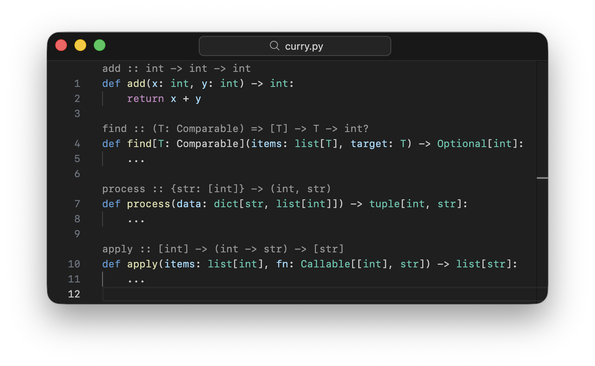

# Python Signature Lens

Display Haskell-style type signatures above Python functions using CodeLens.

## Features

- Curried function signatures displayed above Python function definitions
- Supports generic type parameters and bounded constraints
- Handles class methods with inherited type parameters
- Works with async functions and multi-line signatures

## Type Transformations

| Python | Lens Displays |
|--------|---------------|
| `Optional[T]` | `T?` |
| `T \| None` | `T?` |
| `None \| T` | `T?` |
| `list[T]` | `[T]` |
| `dict[K, V]` | `{K: V}` |
| `set[T]` | `{T}` |
| `tuple[A, B, C]` | `(A, B, C)` |
| `Callable[[A, B], R]` | `(A -> B -> R)` |
| `Callable[[], R]` | `(() -> R)` |
| `"ForwardRef"` | `ForwardRef` |
| `*args: T` | `*T` |
| `**kwargs: T` | `**T` |

## Configuration

| Setting | Description | Default |
|---------|-------------|---------|
| `pythonSignatureLens.enabled` | Enable/disable signatures | `true` |
